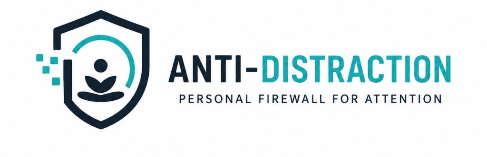

# Anti-Distraction



[](https://github.com/your-username/anti-distraction/actions/workflows/android-ci.yml)
[](LICENSE)
[](app/build.gradle.kts)
[](app/build.gradle.kts)

An offline-first Android attention protection system that helps users maintain focus by introducing deliberate, conscious friction around distracting applications.

---

## Overview

Modern mobile operating systems are designed for continuous engagement. App notifications and instant access often lead to unconscious digital habits. **Anti-Distraction** acts as a personal firewall for attention. Instead of hard-blocking applications permanently, it detects distracting app launches in near-real-time and introduces intentional friction (a 10-second conscious countdown delay and intention selection) to give users time to pause and return to their work.

---

## Features

- **Persistent Focus Sessions**: Timestamp-derived focus timer supporting `DEEP_FOCUS`, `STUDY`, `WORK`, `LIGHT_FOCUS`, and `CUSTOM` profiles. Focus state recovers across app process death and device reboots.
- **Conscious Friction Intervention**: Real-time app launch detection via `AccessibilityService` with a mandatory 10-second countdown delay, intention choice prompts (*Quick task*, *Unconscious habit*, *Emergency call*), and direct Return-to-Focus navigation.
- **Dynamic 6-Level Escalation**: Increases friction severity (`LEVEL_0` to `LEVEL_6`) based on recent attempt frequency and resistance history.
- **2-Minute Temporary Exceptions**: Grants a 2-minute temporary exception when explicitly requested, automatically launching the target app with a Toast notification and restoring restriction after expiration.
- **Emergency Overrides**: Emergency applications (Phone/Dialer, Contacts, Maps, Mobile Banking) bypass restriction instantly across all focus profiles without friction overlay.
- **Distraction Brain Engine**: Mathematical per-app Distraction Score calculation ($S_{app} \in [0, 100]$) with time-of-day impulsivity weighting ($21:00 - 02:00$).
- **Notification Protection & Digest**: Suppresses non-priority notification alerts during active focus sessions and persists notification digests in local Room DB for post-focus review.
- **Schedule Background Automation**: WorkManager periodic evaluation (`ScheduleCheckWorker`) and exact alarm triggers (`ScheduleAlarmReceiver`) for weekly focus routines.
- **Focus Analytics & Insights**: Calculates a transparent 100-point focus score with letter grades (`EXCELLENT`, `GOOD`, `FAIR`) and behavioral insights.
- **100% Local-First Privacy**: Zero `INTERNET` permission in `AndroidManifest.xml`. 100% offline data isolation with zero cloud telemetry.

---

## Architecture

The codebase follows **Clean Architecture** principles, Jetpack Compose Material 3 UI design, Hilt Dependency Injection, and Room DB v3 persistent storage.

```text
Android System Signals
      │
      ▼
Accessibility / System Services
      │
      ▼
Signal Adapters & Event Filters
      │
      ▼
Domain Engines (FocusSessionEngine, RestrictionEngine, InterventionEngine)
      │
      ▼
Repositories & Room Database (AppDatabase v3)
      │
      ▼
UI ViewModels & Jetpack Compose Screens (Material 3 Calm Theme)
```

---

## Privacy & Security

* **Zero Network Permission**: `android.permission.INTERNET` is **omitted** from `AndroidManifest.xml`. The application cannot connect to the internet or send telemetry data.
* **Local Data Architecture**: All app usage attempts, focus sessions, and notification digests are stored strictly in a local Room SQLite database on your device.
* **Minimal Permission Scope**:
  - `BIND_ACCESSIBILITY_SERVICE`: Used strictly to detect foreground package window changes (`typeWindowStateChanged`) with `canRetrieveWindowContent="false"`. Zero text content or private screen data is read.
  - `PACKAGE_USAGE_STATS`: Used to query daily app usage metrics locally.
  - `BIND_NOTIFICATION_LISTENER_SERVICE`: Used strictly to suppress notifications during active focus sessions.

For security policy details, see [SECURITY.md](SECURITY.md).

---

## Requirements

* **Minimum SDK**: Android 8.0 (API Level 26)
* **Target SDK**: Android 14 (API Level 34)
* **JDK**: OpenJDK 17
* **Build System**: Gradle 8.9 / AGP 8.7.2

---

## Building from Source

### Prerequisites
Clone the repository:
```bash
git clone https://github.com/your-username/anti-distraction.git
cd anti-distraction
```

### Build Commands

#### Debug Build (Windows PowerShell):
```powershell
$env:JAVA_HOME="path/to/jdk-17"; .\gradlew.bat assembleDebug
```

#### Debug Build (Linux/macOS):
```bash
export JAVA_HOME=/path/to/jdk-17
./gradlew assembleDebug
```

#### Run Unit Tests:
```powershell
.\gradlew.bat compileDebugUnitTestSources compileReleaseUnitTestSources
```

> **Note on Release Build**: Official release builds require private signing keys (`release-key.jks`) which are excluded from version control. You can build debug artifacts or supply your own signing keystore in `app/build.gradle.kts`.

---

## Project Structure

```text
anti-distraction/
├── .github/
│   ├── workflows/
│   │   ├── android-ci.yml
│   │   └── release.yml
│   ├── ISSUE_TEMPLATE/
│   │   ├── bug_report.md
│   │   └── feature_request.md
│   └── pull_request_template.md
├── app/
│   ├── src/
│   │   ├── main/
│   │   │   ├── java/com/antigravity/antidistraction/
│   │   │   │   ├── data/       # Entities, DAOs, Room DB, Repository Impl
│   │   │   │   ├── domain/     # Focus Engine, Restriction, Intervention, Brain
│   │   │   │   ├── service/    # Accessibility, Notification & Foreground Services
│   │   │   │   ├── ui/         # Jetpack Compose Screens & Material 3 Theme
│   │   │   │   └── worker/     # WorkManager & Alarm Receivers
│   │   │   └── res/            # Layouts, XML configs, Icons
│   │   └── test/               # Unit Test Suites
│   └── build.gradle.kts
├── .gitignore
├── README.md
├── LICENSE
├── CONTRIBUTING.md
├── CODE_OF_CONDUCT.md
├── SECURITY.md
├── CHANGELOG.md
├── build.gradle.kts
├── settings.gradle.kts
└── gradlew.bat
```

---

## Releases

Official signed APK binaries (`app-release.apk`) are published under [GitHub Releases](https://github.com/your-username/anti-distraction/releases).

Every official release includes an verified **SHA-256 Checksum** in the release notes.

---

## Contributing

Contributions are welcome! Please review [CONTRIBUTING.md](CONTRIBUTING.md) and [CODE_OF_CONDUCT.md](CODE_OF_CONDUCT.md) before submitting Pull Requests.

---

## License

This project is licensed under the MIT License - see the [LICENSE](LICENSE) file for details.
